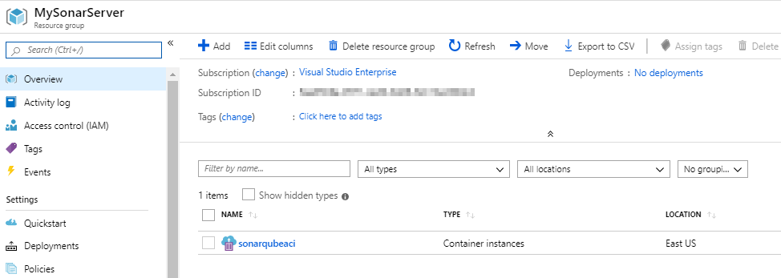
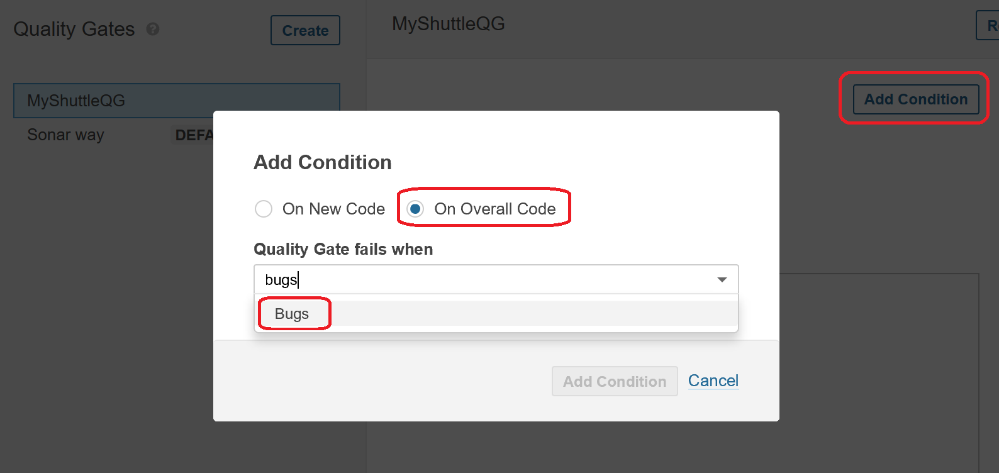
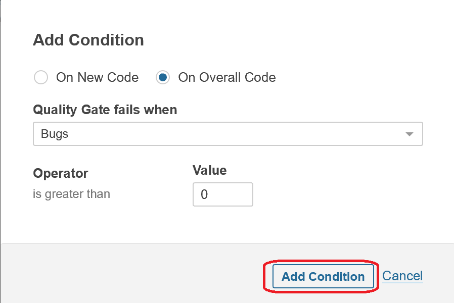
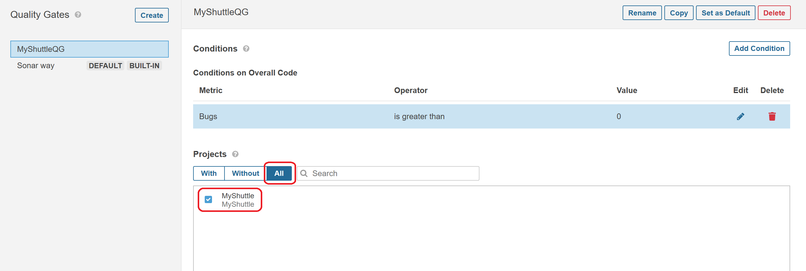
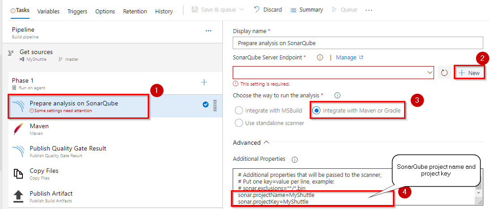
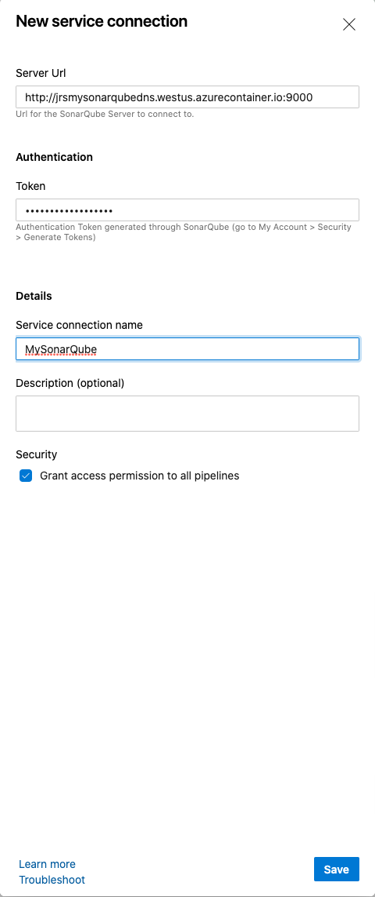
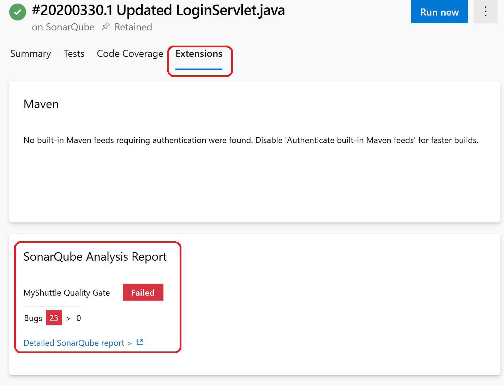
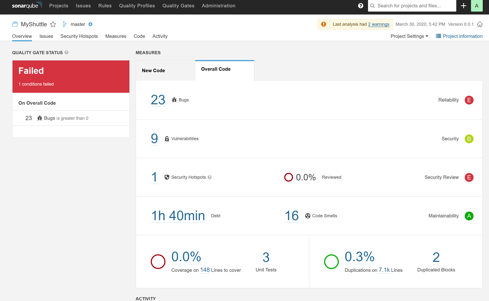
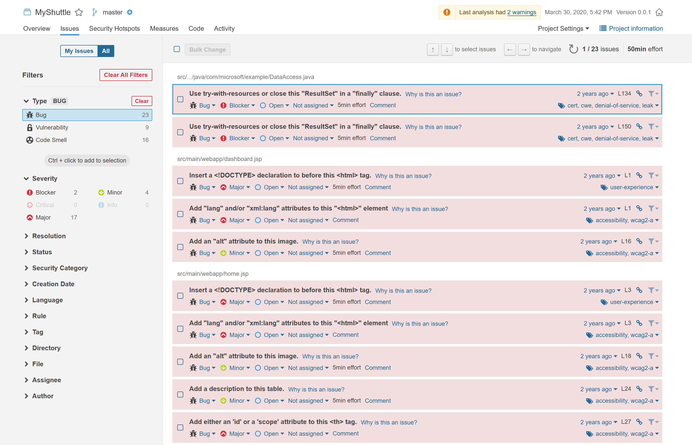

# Azure DevOps code quality

## Overview

Technical debt is the set of problems in a development effort that make forward progress on customer value inefficient. Technical debt saps productivity by making code hard to understand, fragile, time-consuming to change, difficult to validate, and creates unplanned work that blocks progress. Unless they are managed, technical debt can accumulate and hurt the overall quality of the software and the productivity of the development team in the long term

[SonarQube](https://www.sonarqube.org/){:target="_blank"} an open source platform for continuous inspection of code quality to perform automatic reviews with static analysis of code to:

- Detect Bugs
- Code Smells
- Security Vulnerabilities
- Centralize Quality

### What's covered in this lab

In this lab, you will learn how to setup SonarQube on Azure and integrate with Azure DevOps project

- Provision SonarQube server as Azure Container Instance from SonarQube Docker image
- Setup SonarQube project
- Provision an Azure DevOps Project and configure CI pipeline to integrate with SonarQube
- Analyze SonarQube reports

### Before you begin

1. Launch the Azure Cloud Shell from the Azure portal and choose **Bash**.

1. **Setup SonarQube server as Azure Container Instance**:

   i. Create a Resource Group. Replace `<region>` with the region of your choosing, for example, westus.
     
      ```bash
   az group create --name MySonarServer --location <region>
      ```
   ii. Create Azure Container Instance with official SonarQube Docker image.
   `--dns-name-label` must be unique so be sure to add your initials. 
    
      ```bash
   az container create -g MySonarServer --name sonarqubeaci --image sonarqube --ports 9000 --dns-name-label <your initials>mysonarqubedns --cpu 2 --memory 3.5
      ```
    **Parameters**:
         
    |Name  |Description  |
    |---------|---------|
    |`--name`     | Name of the container instance.        |
    |`--image`     |  The container image name. Here we are fetching official [SonarQube image](https://hub.docker.com/_/sonarqube) from DockerHub       |
    |`--ports`     |  The ports to open. The default port for SoanrQube is `9000`. We need to expose this port to access SonarQube.       |
    |`--dns-name-label`     |  The dns name label for container with public IP.       |
    |`--cpu`     |  The required number of CPU cores of the containers.       |
    |`--memory`     |  The required memory of the containers in GB       |
    

1. Once the deployment is successful, you will see the following resources in the Azure Portal.
     
    

1. Use the [Azure DevOps Demo Generator](https://azuredevopsdemogenerator.azurewebsites.net/?TemplateId=77364&Name=SonarQube){:target="_blank"} to provision a project on your Azure DevOps Organization.

## Exercise 1: Create a SonarQube Project and configure Quality Gate

1. Access the **SonarQube** portal providing the DNS name (Or Public IP) suffixed by the port number.

   > The default port for SonarQube is 9000. Copy the DNS name from the created Container Instance in Azure Portal as shown and append :9000 at the end. The final **SonarQube** URL will be **http://YOUR_DNS_NAME:9000**

   

1. Open a browser and login to the SonarQube Portal using the following credentials-

   >**Username= admin, Password= admin**

1. Click **Skip this tutorial**, if it pops up, to see the home page.
 
   

      

1. Choose **Administration** in the toolbar, click **Projects** tab and then **Management**.

   

1. Create a project with **Name** and **Key** as **MyShuttle**.

   - **Name**: Name of the SonarQube project that will be displayed on the web interface.

   - **Key**: The SonarQube project key that is unique for each project.

   - Leave the **Visibility** option to **Public**.

   

   Let us create a Quality Gate to enforce a policy which fails the gate if there are bugs in the code. A Quality Gate is a PASS/FAIL check on a code quality that must be enforced before releasing software.

1. Click the **Quality Gates** menu and click **Create** in the Quality Gates screen. Enter a name for the Quality Gate and click **Create**.

   

1. Let us add a condition to check for the number of bugs in the code. Click on **Add Condition** drop down, select **On Overall Code**, choose the value **Bugs**.

   

1. Set the **is greater than** value to **0** (zero) and click on the **Add** button.

    >This condition means that if the number of bugs in Sonar Analysis is greater than 0 (zero), then the quality gate will fail and this fails the VSTS build.

   

1. To enforce this quality gate for **MyShuttle** project, click on **All** under **Projects** section and select the project checkbox.

   

1. Create a token for authentication. Click **Administrator** icon in the top right, click **My Account**, then choose **Security**. Enter **MyShuttle** for the token name and click **Generate**, be sure to save the token, as it will be needed later and you will not be able to view it again. 

## Exercise 2: Modify the Build to Integrate with SonarQube

Now that the SonarQube server is running, we will modify Azure Build pipeline to integrate with SonarQube to analyze the java code provisioned by the Azure DevOps Demo Generator system.

1. Log into [Azure DevOps Portal](https://dev.azure.com), and go to **pipelines** under **Pipelines** tab, edit the build pipeline **SonarQube**. This is a Java application and we are using [Maven](https://docs.microsoft.com/en-us/azure/devops/pipelines/tasks/build/maven?view=azure-devops) to build the code. And we are using [SonarQube](https://marketplace.visualstudio.com/items?itemName=SonarSource.sonarqube) extension tasks to prepare  analysis on SonarQube and publish Quality Gate results.

1. **Prepare Analysis Configuration** task is to configure all the required settings before executing the build. Click **+ NEW** to add SonarQube server endpoint. 
    
    

   In the **Add SonarQube service connection** wizard enter the SonarQube server URL and SonarQube security token. 
   
    

   > The tokens are used to run analysis or invoke web services without access to the user's actual credentials.

1. **Publish Quality Gate Result** task is to display the Quality Gate status in the build summary.
     
     

1. **Save** the changes and queue the build.

   

1. After the build has completed, click "Pipelines" and then click the job that just completed. You will see that the build has succeeded. To check SonarQube click "**Extensions**"and you'll see the associated  **SonarQube Quality Gate** has **failed**. The  count of bugs is also displayed under **SonarQube Analysis Report**.

   

1. Click on the **Detailed SonarQube Report** link in the build summary to open the project in SonarQube.

   

## Exercise 3: Analyze SonarQube Reports

The link will open the **MyShuttle** project in the SonarQube Dashboard.  Under ***Bugs and Vulnerabilities***, we can see that there are more than "0" bugs reported.

  

  The page has other metrics such as ***Code Smells***, ***Coverage***, ***Duplications*** and ***Size***. The following table briefly explains each of these terms.

   |Terms|Description|
   |-----|-----------|
   |**Bugs**|An issue that represents something wrong in the code. If this has not broken yet, it will, and probably at the worst possible moment. This needs to be fixed|
   |**Vulnerabilities**|A security-related issue which represents a potential backdoor for attackers|
   |**Code Smells**|A maintainability-related issue in the code. Leaving it as-is means that at best maintainers will have a harder time than they should making changes to the code. At worst, they'll be so confused by the state of the code that they'll introduce additional errors as they make changes|
   |**Coverage**|To determine what proportion of your project's code is actually being tested by tests such as unit tests, code coverage is used. To guard effectively against bugs, these tests should exercise or 'cover' a large proportion of your code|
   |**Duplications**|The duplications decoration shows which parts of the source code are duplicated|
   |**Size**|Provides the count of lines of code within the project including the number of statements, Functions, Classes, Files and Directories|

  >In this example, along with the bug count, a character **D** is displayed which is known as **Reliability Rating**. **D** indicates that there is **atleast 1 critical bug** in this code. For more information on Reliability Rating, click [here](https://docs.sonarqube.org/display/SONAR/Metric+Definitions#MetricDefinitions-Reliability)

1. Click on the **Bugs** count to see the details of the bug.

   

With Azure DevOps and SonarQube, the capability is to not only show the health of an application but also to highlight newer issues. With a Quality Gate in place, you can fix the leak and therefore improve code quality systematically. 

## Summary

With SonarQube direct integration with Azure Pipeline, you learnt how to have a quality management tool to ensure that your code is up to standards. You can embed automated testing in your CI/CD pipleine to automate the measurement of your technical debt including code semantics, testing coverage, vulnerabilities. etc.
